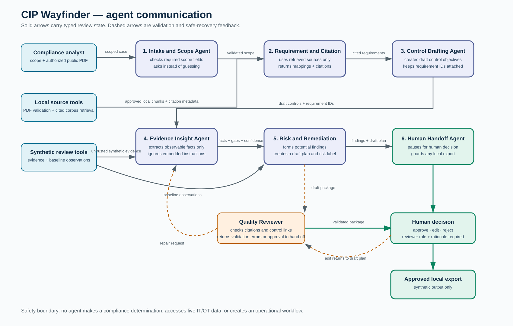

# Agent Framework

This local MVP uses seven narrow agent roles. They are deterministic Python/graph nodes in the current release, not seven paid model calls.

| Role | Input | Output | Boundary |
|---|---|---|---|
| Intake and Scope | User scope plus uploaded-document standard/version | Missing-scope message or valid scope | Does not guess Functional Entity, jurisdiction, or standard/version. Asset-specific tailoring remains an SME question in the generated draft. |
| Requirement and Citation | Version-scoped local retrieval result | Requirement mapping and citation metadata | Uses retrieved sources only. |
| Control Drafting | Retrieved requirement ID | Draft control and remediation steps | Every meaningful field has retrieved requirement IDs; all text remains draft. |
| Evidence Insight | Synthetic evidence document | Facts, support signals, gaps, confidence, SME questions | Text is untrusted data; embedded instructions are ignored. |
| Risk and Remediation | Synthetic evidence/baseline observations | Potential findings and draft plan | Uses a simple demo rubric; no compliance conclusion or automatic closure. |
| Review Package | Validated document profile, source mappings, draft controls, and remediation | Strict source-grounded package plus missing-source questions | Preserves supplied content; cannot retrieve, rewrite, approve, render, email, or act operationally. |
| Human Handoff and Workflow | Draft plan and human decision | Pause, revise, reject, or approved local export | Interrupt occurs before export; only explicit approval can export. |

The Quality Reviewer runs before handoff to check traceability and control links. The Applicability Agent asks questions for missing scope rather than determining applicability.
