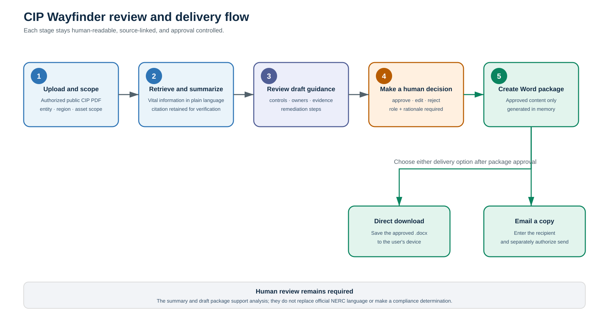

# Final Local MVP Architecture

## Purpose

This is a local, deterministic graph for a fictional review. It uses fake agents and the nine tools from Milestone 4. The current dashboard and tests use synthetic data by default. When an explicitly supplied, approved local NERC corpus is used, retrieval preserves local provenance metadata; it does not crawl the web. The MVP does not declare compliance, provide legal advice, connect to external systems, or change operational controls.

## Components and boundaries


**How to read the diagram:** solid arrows are the normal review path. Dashed arrows are bounded recovery or safe-stop paths. The Streamlit interface presents a deterministic, source-grounded package and approval-gated Word delivery through direct download or configured SMTP. Package approval and email-send authorization are separate gates. The LangGraph path above remains separately implemented and branch-tested.

```text
Streamlit review screens (display + approval-gated in-memory Word export)
  → typed local state and local SQLite case store (explicit save consent)
  → LangGraph review workflow + in-memory checkpointer/thread_id
  → local read/compute tools and deterministic analysts
  → human approval interrupt
  → approved-only synthetic local export below outputs/
```

The only write-classified workflow action is the existing synthetic local export. A local case save also requires an explicit local-save confirmation. Neither action changes an IT/OT asset, external ticket, or operational control.

## Structured-provider learning seam

The codebase retains an optional structured-provider seam for learning and automated testing. It accepts exactly one retrieved requirement mapping and constructs a bounded request containing only its standard/version, requirement reference, source name, source locator, and retrieved excerpt. The response must remain draft-only and every meaningful field must cite exactly that requirement ID. The deterministic fake provider remains the test default. This seam is disconnected from the Streamlit Review package, so product use makes no external model request.

The upload-first interface validates one user-supplied, authorized public CIP-010-5 or CIP-007-6 PDF in browser-session memory. The UI has two workspaces: **Start a review** and **Review package**. After reviewing sources and drafts, a user may approve the exact package for download or email delivery with a reviewer role and rationale. The `.docx` is created in memory and can be downloaded directly. A separate form revalidates the package context, recipient, and explicit send authorization before calling SMTP. The app retains only a masked delivery receipt in session state and does not persist the document.



## Happy path

```text
intake agent
  → requirement lookup tool
  → control drafting agent
  → evidence retrieval tool
  → baseline retrieval tool
  → evidence insight agent
  → gap and risk agent
  → remediation planning agent
  → human approval interrupt
  → approved local export tool
  → completed safe stop
```

## Conditional routes

| Condition | Route | Limit / result |
|---|---|---|
| Missing standard, version, or asset scope | `safe_stop` | Stop without calling a tool. |
| Tool error | `retry_tool` → failed tool | At most two retries after the initial attempt; then safe stop. |
| Empty requirement/evidence/baseline retrieval | `validation_repair` | Repair once. Requirement lookup retries with the known synthetic fixture; other empty retrievals stop after recording the repair. |
| Validation still fails after repair | `safe_stop` | No second repair. |
| No potential finding / remediation plan | `safe_stop` | Stop without export. |
| Pending human decision | `approval_interrupt` | Pause using LangGraph interrupt and checkpoint state. |
| Approve | `simulated_workflow_store` → `safe_stop` | Export only approved synthetic state below `outputs/`. |
| Edit | `edit_plan` → `approval_interrupt` | Return a draft plan to human review. |
| Reject | `safe_stop` | Record rejection and do not export. |

## State and persistence

- A `thread_id` is supplied in LangGraph configuration for every run.
- `InMemorySaver` is the local Milestone 6 checkpointer. It preserves graph state through an interrupt for the life of the running process.
- `LocalCaseStore` can persist typed synthetic `AgentState` plus `thread_id` in ignored local SQLite after an explicit local-save approval. It is used for later resume, not as a workflow system.
- State records review scope, tool retry counters, validation repair counter, synthetic data, draft plan, human decision, route history, status, and any error message.
- Tool retries and validation repair are bounded counters; they are never reset inside a run.

## Safety boundary

- Only the approved route calls the write-classified `simulated_workflow_store` tool.
- The store tool independently checks for an approved `HumanDecision` and enforces the local `outputs/` directory.
- `safe_stop` is terminal and never exports data.
- Evidence document text is untrusted data. The Evidence Analyst extracts only an allowlist of factual labels and ignores instruction-like text.
- Draft controls and remediation text include retrieved requirement IDs; the Quality Reviewer rejects untraceable IDs or mismatched control links.
- Optional LangSmith tracing is configuration-preview only. It reads no key, creates no client, and makes no network call.
